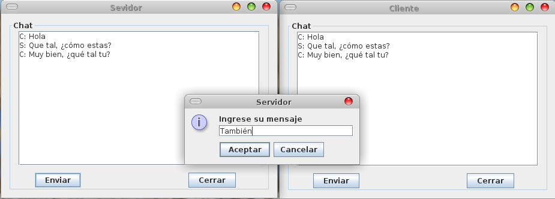

# Chat-Client-Server

## Clone and compile
```
- git clone https://github.com/CristhianMotoche/Chat-Client-Server.git
- cd Chat-Client-Server/
- javac src/*.java
```

## Run server

```
- cd src
- java Server [PORT]
```

## Run client

```
- cd src
- java Client [IP] [PORT]
```


